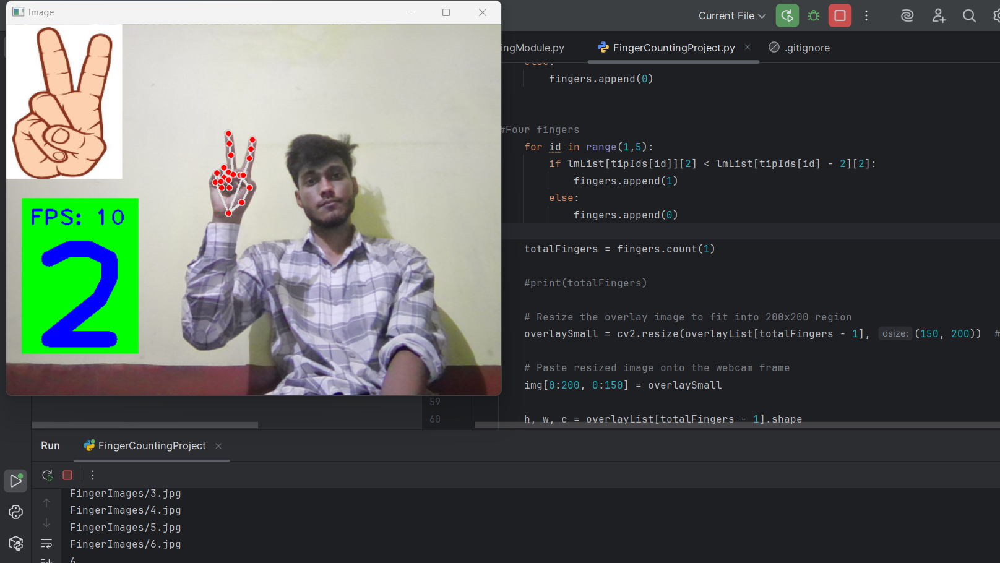

# ✋ Finger Counter using OpenCV & MediaPipe

A real-time finger counting project using Python, OpenCV, and MediaPipe. This application detects hand landmarks via webcam and accurately counts the number of fingers raised. Perfect for beginners to explore gesture recognition and computer vision.

---

## 🎥 Demo Video

[Watch the Demo Video]([(https://youtu.be/kSUgJHKO4Xs)](https://youtu.be/kSUgJHKO4Xs?si=wPgQy6_nHHVHobbJ))

)

## 📌 Features

- Real-time hand tracking
- Finger counting using hand landmarks
- Live webcam feed with visual feedback
- Lightweight and runs smoothly on most systems

---

## 🧰 Technologies Used

- **Python**
- **OpenCV**
- **MediaPipe**
- **PyCharm** (for development)

---
